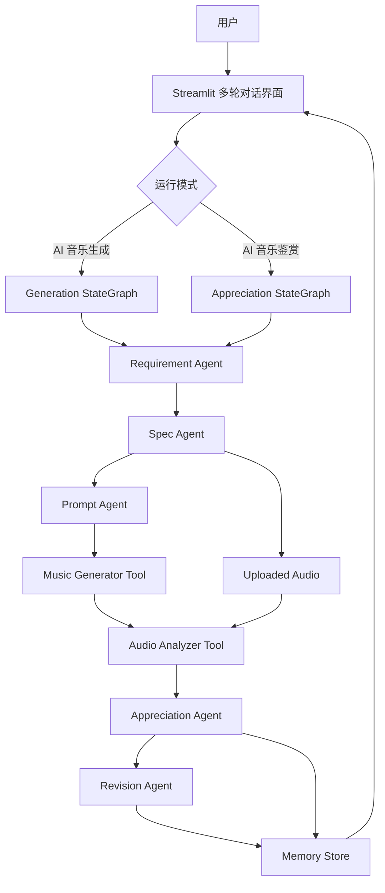
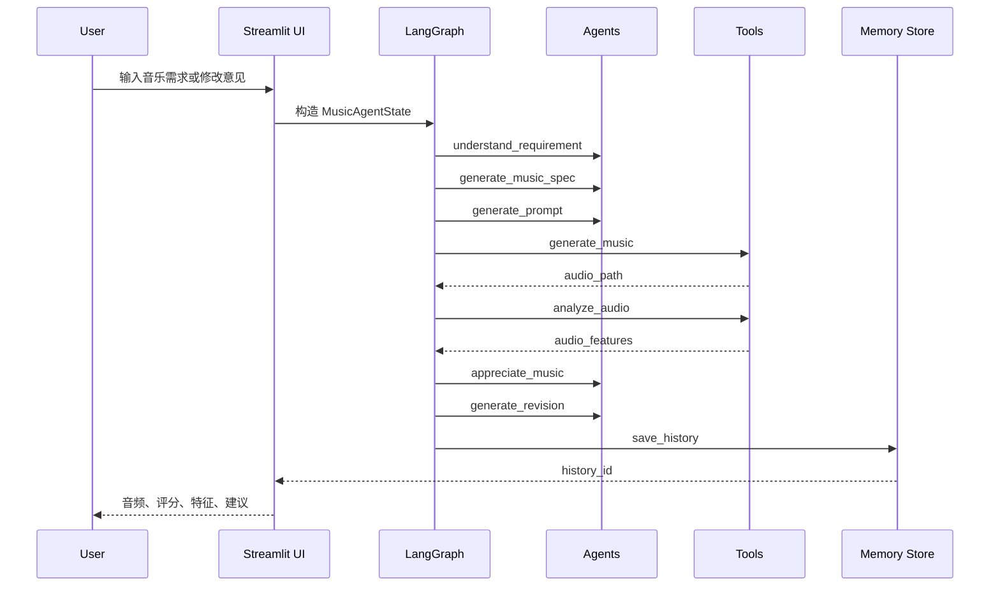
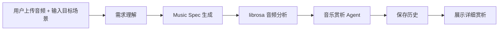
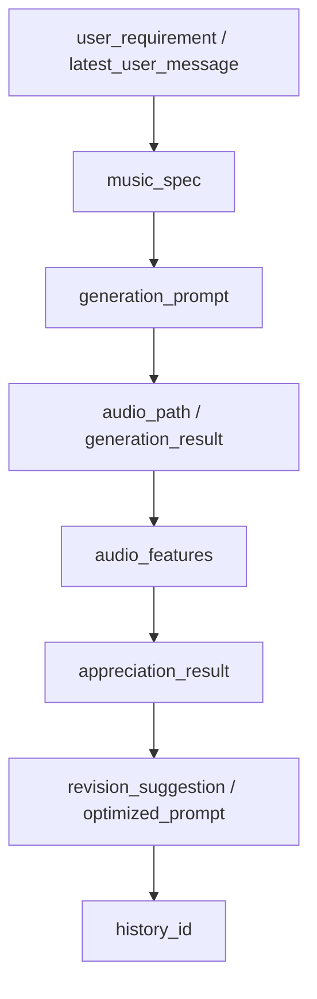

# CS599 期末大作业报告

## MusicAgent Studio：AI 音乐生成与鉴赏迭代智能体

| 字段 | 内容 |
| --- | --- |
| 课程名称 | 企业级应用软件设计与开发 |
| 课程代码 | 50120224001 / CS599 |
| 项目名称 | MusicAgent Studio：AI 音乐生成与鉴赏迭代智能体 |
| 方向 | 方向一：Agentic AI 原生开发 |
| 学号 | 请填写本人学号 |
| 姓名 | 请填写本人姓名 |
| 专业 | 计算机技术 / 软件工程 |
| 指导教师 | 戚欣 |
| GitHub 仓库 | https://github.com/yangbiubiu4225-code/cs599-project |
| 提交日期 | 2026 年 6 月 22 日 |

> PDF 导出说明：本报告采用 Markdown 多级标题组织，使用 Typora、VS Code Markdown Preview Enhanced、Pandoc 或 Word 转 PDF 时，请开启目录/书签/导航窗格，确保最终 PDF 具备可用导航目录。

## 导航目录

- [一、选题背景与设计思想](#一选题背景与设计思想)
- [二、Specs 规格文档](#二specs-规格文档)
- [三、系统架构与设计](#三系统架构与设计)
- [四、关键实现与代码展示](#四关键实现与代码展示)
- [五、测试与评估](#五测试与评估)
- [六、系统升级与扩展](#六系统升级与扩展)
- [七、课程总结](#七课程总结)
- [参考资料](#参考资料)

## 摘要

MusicAgent Studio 是一个面向 AI 音乐创作与音乐赏析场景的 Agentic AI 应用。系统基于 Streamlit 构建多轮对话式前端，使用 LangGraph 编排 Agent 工作流，使用 librosa 进行音频特征分析，并通过 `.env` 管理 API Key 与模型后端配置。项目支持“AI 音乐生成”和“AI 音乐鉴赏”两种模式：生成模式完成“需求理解、Music Spec 生成、Prompt 生成、音乐生成、音频分析、鉴赏评价、修改建议、历史保存”的完整闭环；鉴赏模式跳过音乐生成阶段，直接分析用户上传音频，并输出较详细的音乐赏析。

项目选择课程方向一“Agentic AI 原生开发”。其核心价值在于将音乐创作任务从一次性表单提交升级为多轮 Agent 工作流：用户可以持续提出修改意见，系统会结合上一轮 Music Spec、评分与问题摘要，重新生成规格、Prompt、鉴赏结果和优化建议。为了保证课堂 Demo 稳定性，音乐生成采用“本地 Mock + 可选 MusicGen”的双后端设计：默认 mock 后端可离线运行，MusicGen 后端可在安装额外依赖后启用，并支持失败时自动回退到 mock。

关键词：Agentic AI；SDD；LangGraph；Streamlit；librosa；MusicGen；音乐生成；音乐鉴赏

---

# 一、选题背景与设计思想

## 1.1 问题定义

随着 AIGC 技术从文本、图像扩展到音频与音乐领域，用户已经可以通过自然语言描述生成音乐片段。但在真实创作过程中，单次生成往往难以满足完整需求。用户不只关心“是否生成了音频”，还会关注音乐是否符合特定场景、情绪、节奏、音色、结构和记忆点。例如，用户可能先提出“生成适合科幻短片开场的神秘电子音乐”，听完后又要求“更明亮一些、节奏更紧凑、主旋律更容易记住”。这类任务天然具有多轮迭代特征。

传统网页表单只能完成“输入需求、返回结果”的单步流程，很难体现需求理解、工具调用、结果分析和下一轮优化之间的关系。因此，本项目将音乐创作流程设计为一个 Agentic AI 系统：系统不仅生成音乐，还会分析音频、评价结果、提出修改建议，并将历史上下文用于下一轮对话。

## 1.2 现有方案不足

现有 AI 音乐工具或简单课程 Demo 通常存在以下不足：

| 不足 | 表现 |
| --- | --- |
| 单轮生成 | 用户只能提交一次 Prompt，缺少“听后修改”的闭环 |
| 缺少结构化中间状态 | 很难解释模型为什么这样生成，也不方便调试 |
| 评价依赖主观文本 | 缺少客观音频特征支撑，如 tempo、能量、频谱亮度等 |
| 演示稳定性不足 | 依赖大型模型下载或外部 API，课堂网络不稳定时容易失败 |
| 前端像普通数据库页面 | 用户体验偏表单化，缺少 Agent 多轮交互感 |

MusicAgent Studio 针对这些不足，将自然语言需求转化为 Music Spec，再通过工作流调用生成工具、分析工具和鉴赏 Agent，形成一个可解释、可复用、可扩展的 Agent 系统。

## 1.3 项目价值

本项目的价值主要体现在三个方面。

第一，面向真实创作流程。音乐创作不是一次性任务，而是反复调整的过程。系统通过多轮对话和历史状态，让用户可以基于上一轮结果继续提出修改意见。

第二，体现 Agentic AI 工程闭环。项目不是单纯调用模型，而是包含状态管理、工作流编排、工具调用、结果评估和记忆保存，符合课程“从代码编写者到智能体编排者”的核心理念。

第三，兼顾可运行性与扩展性。默认 mock 后端保证课程 Demo 稳定运行；可选 MusicGen 后端提供真实 AI 音乐生成能力；未来也可以替换为云端音乐生成 API 或更强的本地模型。

## 1.4 技术路线

本项目选择课程方向一：Agentic AI 原生开发。整体技术路线如下：

```text
用户多轮音乐需求
-> 需求理解
-> Music Spec 规格化
-> Prompt 生成
-> 音乐生成或上传音频
-> librosa 音频分析
-> 鉴赏评价
-> 修改建议 / 赏析输出
-> 历史记录保存
```

技术选型如下：

| 类别 | 本项目使用 |
| --- | --- |
| AI IDE | Trae CN / AI 辅助开发工具 |
| 前端 | Streamlit |
| Agent 框架 | LangGraph |
| 音频分析 | librosa、numpy、soundfile |
| 音乐生成 | 本地 Mock、Hugging Face Transformers MusicGen |
| 配置管理 | python-dotenv、`.env` |
| 基础设施 | Git、GitHub |
| 评估 | 测试样例、端到端字段完整性评估、音频特征解释 |

## 1.5 核心技术要素覆盖

课程要求方向一至少涵盖 4 项核心技术要素，本项目覆盖情况如下：

| 核心技术要素 | 项目实现 |
| --- | --- |
| SDD 规格驱动开发 | 提供 Product Spec、Architecture Spec、API Spec，并在代码中按规格拆分模块 |
| 工具使用 / Function Calling 思想 | Agent 节点调用音乐生成工具、音频分析工具、历史存储工具 |
| 记忆机制 | 使用 Streamlit session 保存多轮对话上下文，使用 JSON 保存历史记录 |
| 状态管理与多步骤推理 | 使用 LangGraph `StateGraph` 和 `MusicAgentState` 管理多节点状态流转 |
| Agentic RAG | 使用本地 Markdown 音乐知识库和 `retrieve_music_context` 节点增强 Spec、Prompt 和鉴赏 |
| 可观测性与评估 | 提供 `src/eval/test_cases.json` 和 `src/eval/evaluate.py` 检查工作流输出完整性 |

---

# 二、Specs 规格文档

本项目采用 SDD（Specification Driven Development，规格驱动开发）思路，将需求、架构和接口先规格化，再映射到具体代码。项目文档位于 `docs/` 目录：

```text
docs/
├── product_spec.md
├── architecture.md
├── api_spec.md
└── CS599_大作业报告.md
```

## 2.1 Product Spec

### 2.1.1 产品定位

MusicAgent Studio 是一个课程 Demo 级 AI 音乐 Agent 系统，面向 AI 音乐生成、音乐赏析和创作迭代场景。它的目标不是替代专业 DAW 或商业音乐平台，而是展示如何用 Agentic AI 方法组织一个完整的创作与评价工作流。

### 2.1.2 目标用户

| 用户 | 需求 |
| --- | --- |
| 课程教师与同学 | 查看 Agentic AI 项目的完整工程闭环 |
| AI 音乐创作爱好者 | 通过自然语言快速生成音乐草稿并获得修改建议 |
| 需要音乐鉴赏辅助的用户 | 上传音频，获得结构化听感分析 |
| 开发者 | 参考一个 Streamlit + LangGraph + librosa 的垂直领域 Agent 示例 |

### 2.1.3 核心功能

| 功能 | 说明 |
| --- | --- |
| 多轮对话输入 | 用户以聊天形式描述音乐需求或继续提出修改意见 |
| 生成模式 | 完成需求理解、规格生成、Prompt 生成、音乐生成、音频分析、鉴赏评价和修改建议 |
| 鉴赏模式 | 上传音频并结合目标场景输出详细赏析 |
| Music Spec | 将自然语言需求转化为结构化字段，如风格、情绪、速度、调性、结构、乐器 |
| 音频分析 | 使用 librosa 提取 duration、tempo、rms、spectral centroid、zero crossing rate、onset strength |
| 修改建议 | 根据鉴赏问题生成下一轮优化建议和简短中文优化 Prompt |
| 历史保存 | 将每轮状态保存为 JSON 文件，支持后续查看与扩展 |

### 2.1.4 非目标

| 非目标 | 说明 |
| --- | --- |
| 专业 DAW 编辑 | 当前不提供多轨编辑、混音、自动母带等能力 |
| 商业级音乐版权管理 | 当前不处理版权检测与授权 |
| 强依赖外部 API | 为保证 Demo 稳定，默认使用本地 mock 后端 |
| 完整生产部署 | 当前重点是课程项目闭环，部署为后续扩展方向 |

## 2.2 Architecture Spec

系统采用前端层、工作流层、Agent 层、工具层、知识层和存储层的分层结构。

| 层级 | 模块 | 职责 |
| --- | --- | --- |
| 前端层 | `src/app.py` | 多轮对话、模式选择、音频上传、结果展示 |
| 工作流层 | `src/graph/music_graph.py` | 使用 LangGraph 编排生成模式与鉴赏模式 |
| 状态层 | `src/graph/state.py` | 定义 `MusicAgentState`，统一传递上下文 |
| Agent 层 | `src/agents/` | 需求理解、Spec 生成、Prompt 生成、鉴赏、修改建议 |
| 工具层 | `src/tools/` | RAG 检索、音乐生成、音频分析、历史存储、报告整理 |
| 知识层 | `src/knowledge/` | 音乐风格、鉴赏评分、Prompt 示例知识库 |
| 评估层 | `src/eval/` | 测试样例和工作流字段完整性评估 |
| 配置层 | `src/config.py`、`.env` | 读取 API Key、模型、后端和运行参数 |

## 2.3 API Spec

本项目目前主要提供 Python 函数接口，而非网络 API。

### 2.3.1 生成工作流

```python
run_generation_workflow(
    user_requirement: str,
    generator_backend: str = "mock",
    latest_user_message: str = "",
) -> MusicAgentState
```

功能：执行完整音乐生成 Agent 工作流。  
输出：包含 Music Spec、Prompt、音频路径、音频特征、鉴赏结果、修改建议和历史 ID 的完整状态。

### 2.3.2 鉴赏工作流

```python
run_appreciation_workflow(
    user_requirement: str,
    audio_path: str,
    latest_user_message: str = "",
) -> MusicAgentState
```

功能：分析用户上传音频并输出音乐赏析。  
特点：跳过音乐生成和修改建议节点，突出音频理解与赏析。

### 2.3.3 音频分析工具

```python
analyze_audio(audio_path: str | Path) -> dict
```

返回 JSON 可序列化结果：

```json
{
  "success": true,
  "audio_path": "data/generated/example.wav",
  "features": {
    "duration": 12.0,
    "tempo": 120.0,
    "rms_energy": 0.1,
    "spectral_centroid_mean": 1200.0,
    "zero_crossing_rate_mean": 0.04,
    "onset_strength_mean": 0.8
  },
  "error": null
}
```

### 2.3.4 音乐生成工具

```python
generate_music(state: MusicAgentState) -> MusicAgentState
```

支持后端：

| 后端 | 说明 |
| --- | --- |
| `mock` | 本地合成 `.wav`，适合课堂 Demo |
| `musicgen` | 使用 Hugging Face Transformers 调用 MusicGen |

### 2.3.5 历史保存工具

```python
save_history(state: MusicAgentState) -> MusicAgentState
```

功能：将本轮运行快照保存到 `data/history/{history_id}.json`。

## 2.4 SDD 与代码映射

| Spec 内容 | 代码实现 |
| --- | --- |
| 双模式产品需求 | `run_generation_workflow`、`run_appreciation_workflow` |
| RAG 检索规格 | `src/tools/rag_retriever.py`、`src/knowledge/` |
| Music Spec 数据结构 | `src/agents/spec_agent.py` |
| Agent 状态字段 | `src/graph/state.py` |
| 工作流节点 | `src/graph/music_graph.py` |
| 音频特征要求 | `src/tools/audio_analyzer.py` |
| Mock + MusicGen 后端 | `src/tools/music_generator.py` |
| 多轮对话前端 | `src/app.py` |
| 历史记录 | `src/tools/memory_store.py` |

---

# 三、系统架构与设计

## 3.1 总体架构图



## 3.2 Agent 交互流程

生成模式完整流程如下：



鉴赏模式流程如下：



## 3.3 数据流设计

系统所有节点围绕 `MusicAgentState` 读写状态。每个节点只返回自己负责更新的字段，避免模块之间直接互相调用造成耦合。



核心状态字段：

| 字段 | 用途 |
| --- | --- |
| `user_requirement` | 当前完整需求上下文 |
| `latest_user_message` | 本轮最新输入，优先级高于旧上下文 |
| `music_spec` | 结构化音乐规格 |
| `generation_prompt` | 音乐生成 Prompt |
| `audio_path` | 生成或上传音频路径 |
| `audio_features` | librosa 分析结果 |
| `appreciation_result` | 鉴赏评价、评分、优点、问题、详细赏析 |
| `revision_suggestion` | 下一轮修改建议 |
| `optimized_prompt` | 可复制到下一轮的简短中文 Prompt |
| `history_id` | 历史记录标识 |

## 3.4 双模式复用设计

两个模式并不是两套重复系统，而是共享核心模块：

| 共享模块 | 生成模式 | 鉴赏模式 |
| --- | --- | --- |
| Requirement Agent | 使用 | 使用 |
| Spec Agent | 使用 | 使用 |
| Audio Analyzer Tool | 分析生成音频 | 分析上传音频 |
| Appreciation Agent | 评分与问题诊断 | 详细赏析 |
| Memory Store Tool | 保存生成记录 | 保存鉴赏记录 |

这种设计使系统具备扩展性。后续如果增加“风格迁移模式”“音频改编模式”“多版本对比模式”，可以复用已有音频分析和鉴赏模块，只需新增或调整图中的部分节点。

---

# 四、关键实现与代码展示

## 4.1 LangGraph 工作流

生成模式和鉴赏模式由 `src/graph/music_graph.py` 定义。接入 RAG 后，生成模式包含 9 个节点，鉴赏模式包含 6 个节点。系统在 `understand_requirement` 与 `generate_music_spec` 之间加入 `retrieve_music_context`，先检索本地音乐知识库，再继续生成 Music Spec。

```python
def build_generation_graph():
    graph = StateGraph(MusicAgentState)
    graph.add_node("understand_requirement", understand_requirement)
    graph.add_node("retrieve_music_context", retrieve_music_context)
    graph.add_node("generate_music_spec", generate_music_spec)
    graph.add_node("generate_prompt", generate_prompt)
    graph.add_node("generate_music", generate_music)
    graph.add_node("analyze_audio", analyze_audio)
    graph.add_node("appreciate_music", appreciate_music)
    graph.add_node("generate_revision", generate_revision)
    graph.add_node("save_history", save_history)

    graph.set_entry_point("understand_requirement")
    graph.add_edge("understand_requirement", "retrieve_music_context")
    graph.add_edge("retrieve_music_context", "generate_music_spec")
    graph.add_edge("generate_music_spec", "generate_prompt")
    graph.add_edge("generate_prompt", "generate_music")
    graph.add_edge("generate_music", "analyze_audio")
    graph.add_edge("analyze_audio", "appreciate_music")
    graph.add_edge("appreciate_music", "generate_revision")
    graph.add_edge("generate_revision", "save_history")
    graph.add_edge("save_history", END)
    return graph.compile()
```

这段代码体现了 Agentic AI 的核心思想：系统不再是单个函数，而是由多个节点构成的状态机。每个节点处理一个明确任务，并将结果写入共享状态。

## 4.2 状态定义

`MusicAgentState` 使用 `TypedDict` 定义，保证每个节点可以共享同一套状态字段。

```python
class MusicAgentState(TypedDict, total=False):
    run_mode: str
    generator_backend: str
    user_requirement: str
    latest_user_message: str
    music_spec: dict[str, Any]
    generation_prompt: str
    audio_path: Optional[str]
    generation_result: dict[str, Any]
    audio_features: dict[str, Any]
    appreciation_result: dict[str, Any]
    revision_suggestion: str
    optimized_prompt: str
    history_id: str
```

该设计让工作流具有可解释性：任意时刻都可以查看当前状态，了解系统已经完成哪些步骤、生成了哪些中间结果。

## 4.3 多轮对话上下文

前端通过 `st.session_state.messages` 保存多轮对话，通过 `last_result` 保存上一轮 Agent 输出。新一轮用户输入会与上一轮 Music Spec、评分和问题摘要组合成新需求。

```python
def _compose_requirement(user_message, last_result):
    if not last_result:
        return user_message.strip()

    previous_spec = last_result.get("music_spec", {})
    previous_score = last_result.get("appreciation_result", {}).get("overall_score", "暂无")
    previous_issues = last_result.get("appreciation_result", {}).get("issues", [])

    return f"""
上一轮音乐方向：
风格={previous_spec.get("style", "未知")}；
情绪={previous_spec.get("mood", "未知")}；
速度={previous_spec.get("tempo_bpm", "未知")} BPM

上一轮鉴赏分数：
{previous_score}

上一轮待优化点：
{"；".join(previous_issues[:3]) if previous_issues else "暂无明显问题"}

请以本轮用户追加要求为最高优先级：
{user_message.strip()}
""".strip()
```

这个设计解决了早期版本“多轮对话结果相同”的问题，使最新用户意图能够影响下一轮 Spec、Prompt、评分和修改建议。

## 4.4 RAG 检索工具

项目新增 `src/tools/rag_retriever.py`，对 `src/knowledge/` 下的 Markdown 音乐知识库进行轻量关键词检索。检索结果写入 `retrieved_context`、`rag_sources` 和 `rag_matches`，后续节点可以使用这些上下文增强输出。

```python
def retrieve_music_context(query: str, top_k: int = 3) -> dict[str, Any]:
    query_terms = _tokens(query)
    chunks = _load_chunks()
    # score chunks by keyword overlap
    return {
        "retrieved_context": context,
        "rag_sources": sources,
        "rag_matches": matches,
    }
```

该设计不依赖向量数据库，适合课程 Demo；同时它在 LangGraph 中作为真实节点存在，能够展示 Agentic RAG 的工作方式。

## 4.5 音频分析工具

`src/tools/audio_analyzer.py` 使用 librosa 提取音频特征，并提供异常处理。

```python
y, sample_rate = librosa.load(path, sr=None, mono=True)
duration = librosa.get_duration(y=y, sr=sample_rate)
tempo, _ = librosa.beat.beat_track(y=y, sr=sample_rate)
rms = librosa.feature.rms(y=y)
spectral_centroid = librosa.feature.spectral_centroid(y=y, sr=sample_rate)
zero_crossing_rate = librosa.feature.zero_crossing_rate(y)
onset_strength = librosa.onset.onset_strength(y=y, sr=sample_rate)
```

提取结果用于后续鉴赏 Agent：

| 特征 | 对应听感解释 |
| --- | --- |
| `duration` | 音频长度 |
| `tempo` | 节奏速度 |
| `rms_energy` | 能量和响度倾向 |
| `spectral_centroid_mean` | 音色明亮度 |
| `zero_crossing_rate_mean` | 高频活动与粗糙度 |
| `onset_strength_mean` | 起音强度和节奏攻击性 |

## 4.6 音乐生成工具

音乐生成工具支持 mock 和 MusicGen 两个后端。

```python
requested_backend = (
    state.get("generator_backend")
    or os.getenv("MUSIC_GENERATOR_BACKEND", "mock")
).lower()

try:
    if requested_backend == "musicgen":
        audio_path = _write_musicgen_audio(state, history_id)
    else:
        audio_path = _write_mock_audio(state, history_id)
except Exception as exc:
    fallback_enabled = os.getenv("MUSICGEN_FALLBACK_TO_MOCK", "true").lower()
    if requested_backend != "musicgen" or fallback_enabled not in {"1", "true", "yes"}:
        raise

    audio_path = _write_mock_audio(state, history_id)
```

mock 后端保证课程演示稳定；MusicGen 后端提供真实 AI 音乐生成能力；自动回退机制保证即使模型下载或加载失败，系统仍能完成工作流。

## 4.7 配置与安全

项目使用 `.env` 管理配置，避免硬编码 API Key。

```python
load_dotenv()

@dataclass(frozen=True)
class Settings:
    app_name: str = os.getenv("APP_NAME", "MusicAgent Studio")
    openai_api_key: str | None = os.getenv("OPENAI_API_KEY") or None
    music_generator_backend: str = os.getenv("MUSIC_GENERATOR_BACKEND", "mock")
    musicgen_model: str = os.getenv("MUSICGEN_MODEL", "facebook/musicgen-small")
```

`.env.example` 提供模板，真实 `.env` 被 `.gitignore` 排除，不会提交到 GitHub。

## 4.8 AI IDE 使用说明

项目开发过程中使用 AI 辅助开发方式完成需求拆解、模块规划、代码迭代、报错定位与文档整理。建议在最终 PDF 中补充以下截图：

| 截图 | 内容 |
| --- | --- |
| 图 4-1 | Trae CN / AI IDE 中进行需求分析或代码生成的截图 |
| 图 4-2 | 多轮对话界面运行截图 |
| 图 4-3 | GitHub 提交历史或项目仓库截图 |

> 提交 PDF 前，请将截图放入 `docs/demo_screenshots/` 并插入本节，以满足课程“AI IDE 使用截图”和 Demo 展示要求。

---

# 五、测试与评估

## 5.1 功能测试

项目提供基础测试文件 `src/eval/test_cases.json`，覆盖两类典型音乐需求：

| 测试用例 | 输入需求 | 后端 | 预期 |
| --- | --- | --- | --- |
| cinematic_electronic | 科幻短片开场、神秘、影视电子 | mock | 生成完整状态字段 |
| calm_lofi | 安静学习、lo-fi、柔和节奏 | mock | 生成完整状态字段 |

运行方式：

```bash
python src/eval/evaluate.py
```

评估脚本会检查以下字段是否存在：

```text
music_spec
generation_prompt
audio_path
generation_result
audio_features
appreciation_result
revision_suggestion
history_id
```

## 5.2 Agent 行为评估

本项目对 Agent 行为的评估重点不是只看模型输出文本，而是检查多步骤工作流是否完整、状态是否正确传递、工具调用是否成功。

| 评估维度 | 检查方式 |
| --- | --- |
| 工作流完整性 | 是否从需求理解走到历史保存 |
| Spec 合理性 | 是否包含风格、情绪、速度、调性、结构和乐器 |
| Prompt 可用性 | 是否将 Music Spec 转换为可被音乐模型理解的 Prompt |
| 音频分析有效性 | 是否成功提取 tempo、能量、频谱、起音等特征 |
| 多轮变化度 | 第二轮用户要求是否影响 Spec、评分和修改建议 |
| 鉴赏可解释性 | 是否引用音频特征并输出具体听感解释 |

## 5.3 Demo 结果展示

生成模式典型输出：

| 输出区域 | 示例内容 |
| --- | --- |
| Music Spec | style、mood、tempo_bpm、key、duration、structure、instruments |
| Prompt | 面向 MusicGen 或 mock 后端的音乐生成描述 |
| 音频播放 | 播放生成 `.wav` 文件 |
| 音频特征 | duration、tempo、rms_energy、spectral_centroid_mean 等 |
| 鉴赏结果 | 分数、优点、问题、profile scores |
| 修改建议 | 下一轮优化方向与中文优化 Prompt |

鉴赏模式典型输出：

| 输出区域 | 示例内容 |
| --- | --- |
| 上传音频 | 用户上传 wav/mp3/flac/ogg/m4a |
| 音频特征 | librosa 分析结果 |
| 详细赏析 | 整体印象、节奏与律动、音色与空间、情绪表达、适用场景 |
| 历史记录 | history_id 与本轮 JSON 快照 |

## 5.4 当前测试结论

从现有测试与运行情况看，项目已经实现端到端 MVP：

1. 可以通过 Streamlit 页面启动并完成多轮对话。
2. 生成模式可以输出音频、Music Spec、Prompt、音频特征、鉴赏结果和修改建议。
3. 鉴赏模式可以上传音频并输出更详细的赏析。
4. mock 后端保证不依赖外部模型即可完成课堂演示。
5. `.env`、虚拟环境、生成音频、上传音频和历史 JSON 已通过 `.gitignore` 排除，避免污染仓库。

## 5.5 Benchmark 与可观测性不足

当前评估仍偏轻量，主要验证字段完整性和流程可运行性。后续可以增加：

| 改进方向 | 说明 |
| --- | --- |
| 多轮 Benchmark | 设计连续修改任务，检查每轮结果是否符合新增要求 |
| 音频特征对照 | 对不同风格音频统计 tempo、能量、亮度差异 |
| LLM-as-Judge | 使用 LLM 评估鉴赏文本是否准确、具体、可执行 |
| Trace 记录 | 记录每个节点输入输出、耗时和错误 |
| UI 自动化测试 | 使用 Playwright 检查页面流程 |

---

# 六、系统升级与扩展

## 6.1 更强的 LLM 推理能力

当前 Agent 节点主要使用规则和启发式逻辑完成需求解析、Spec 生成和鉴赏描述。下一阶段可以接入 OpenAI API、DeepSeek API 或本地 Ollama 模型，让 Requirement Agent 和 Appreciation Agent 具备更强的自然语言理解能力。

升级后流程可以变为：

```text
用户需求 -> LLM 解析意图 -> 结构化 Music Spec -> 工具执行 -> LLM 生成更自然的鉴赏与建议
```

## 6.2 MusicGen 后端增强

当前 MusicGen 是可选本地后端，适合在具备模型环境时运行。未来可以增加：

| 方向 | 说明 |
| --- | --- |
| 后台异步生成 | 避免 Streamlit 页面长时间阻塞 |
| GPU / MPS 检测 | 自动选择最佳设备 |
| 模型缓存管理 | 展示模型是否已下载、缓存大小和路径 |
| 多模型选择 | 支持 small、medium 或其他音乐模型 |
| 云端生成 API | 在服务器部署模型或调用第三方音乐生成服务 |

## 6.3 长期记忆与个性化

当前记忆机制包括会话内 `session_state` 和本地 JSON 历史记录。后续可以升级为：

| 记忆类型 | 作用 |
| --- | --- |
| 用户偏好记忆 | 记住用户常用风格、速度、音色偏好 |
| 历史作品检索 | 找到相似历史生成结果 |
| 向量数据库 | 对历史 Prompt、Spec 和鉴赏文本做语义检索 |
| 版本树 | 管理每轮修改之间的关系 |

## 6.4 可观测性与 LLMOps

为了达到更接近生产级水平，可以为每个 Agent 节点记录：

| 信息 | 用途 |
| --- | --- |
| 节点输入输出 | 调试工作流 |
| 执行耗时 | 分析性能瓶颈 |
| 工具错误 | 追踪失败原因 |
| 生成后端 | 区分 mock 与 MusicGen |
| 用户反馈 | 形成后续评估数据 |

## 6.5 MCP / 高级 RAG 扩展

当前项目已经实现本地 Markdown 轻量 RAG。未来可以继续升级为 MCP 工具服务或向量检索版 RAG：

| 扩展 | 价值 |
| --- | --- |
| MCP 音频工具服务 | 将音频分析、格式转换、波形可视化封装为外部工具 |
| 音乐知识库 RAG | 检索风格、编曲、配器知识，增强赏析质量 |
| 案例库检索 | 根据用户需求找到相似音乐案例 |
| 多 Agent 协作 | 拆分为 Composer Agent、Critic Agent、Curator Agent |

## 6.6 云服务器部署

课程加分项包含云服务器部署。后续可以部署到云服务器并提供可访问 URL：

```text
GitHub 仓库
-> 云服务器拉取代码
-> Conda / Docker 安装依赖
-> Streamlit 服务启动
-> Nginx / 端口映射
-> 提供 Demo URL
```

如果部署 MusicGen，需要额外考虑模型缓存、内存、GPU 或 CPU 生成耗时。

---

# 七、课程总结

## 7.1 个人收获

通过本项目，我对“AI 驱动的软件开发与 Agentic AI”有了更具体的理解。传统开发中，我更关注如何把一个函数或页面写出来；而 Agentic AI 项目更关注如何把任务拆成多个可协作节点，如何设计中间状态，如何让工具调用、模型推理、用户交互和历史记忆形成闭环。

MusicAgent Studio 的开发过程让我认识到，Agent 系统的关键不只是“调用一个大模型”，而是要设计清楚 Agent 在每一步看见什么、输出什么、调用什么工具、如何处理失败、如何让下一轮迭代利用上一轮结果。比如本项目中，如果没有 `MusicAgentState`，各个节点之间就会难以传递上下文；如果没有 mock 后端，课堂 Demo 就可能受模型下载和网络环境影响；如果没有多轮对话设计，系统就会更像普通数据库网页，而不是智能体。

## 7.2 工程思维转变

本课程强调从“代码编写者”到“智能体编排者”的转变。这个项目中的几个实践让我体会较深：

1. 先写规格，再写代码。Product Spec、Architecture Spec 和 API Spec 能帮助我在实现前明确系统边界。
2. 工作流比单点功能更重要。一个 Agent 应用需要考虑完整链路，而不是只完成某个单独函数。
3. 工具调用需要可解释。音频分析工具的输出必须能被鉴赏 Agent 转化为人能理解的评价。
4. Demo 稳定性是工程能力的一部分。mock 后端和 MusicGen 回退机制让项目在不同环境下都能展示核心流程。
5. 多轮交互需要状态设计。没有历史上下文和最新用户意图优先级，就容易出现每轮结果一致的问题。

## 7.3 对课程的建议

课程将 AI IDE、Agent 框架、SDD 和 GitHub 工程实践结合起来，能够帮助学生理解当前 AI 原生软件开发的真实趋势。建议后续课程可以进一步增加：

| 建议 | 说明 |
| --- | --- |
| 更多 Agent 项目案例拆解 | 展示优秀项目如何设计状态、工具和评估 |
| 部署实践指导 | 增加云服务器或 Docker 部署的课堂示范 |
| 可观测性专题 | 讲解 tracing、benchmark、LLMOps 在 Agent 项目中的使用 |
| Demo Day 评分样例 | 提供优秀报告和演示视频示例，帮助学生把握深度 |

总体而言，本项目让我从一个具体垂直场景出发，完整实践了 AI Agent 的需求分析、规格设计、架构拆分、代码实现、测试评估和文档交付流程。这种训练比单纯完成算法或页面更接近未来 AI 原生应用开发的工作方式。

---

# 参考资料

1. CS599 期末大作业要求：企业级应用软件设计与开发（AI 驱动的软件开发与 Agentic AI），版本 v2.2，2026-06-02。
2. LangGraph 官方文档：https://langchain-ai.github.io/langgraph/
3. Streamlit 官方文档：https://docs.streamlit.io/
4. librosa 官方文档：https://librosa.org/doc/
5. Hugging Face Transformers MusicGen 文档：https://huggingface.co/docs/transformers/model_doc/musicgen
6. MusicAgent Studio 项目仓库：https://github.com/yangbiubiu4225-code/cs599-project
