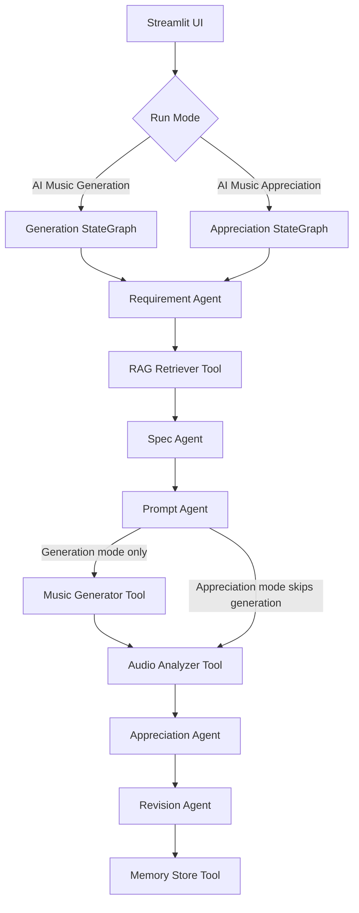

# Architecture

## Overview

MusicAgent Studio uses Streamlit for the UI and LangGraph for workflow orchestration. The system has two user-facing modes: AI music generation and AI music appreciation. Each graph node delegates work to a focused agent or tool module. The workflow now includes a lightweight Agentic RAG node that retrieves local music knowledge before building the Music Spec.

## State

The shared state is `MusicAgentState` in `src/graph/state.py`. It contains run mode, generator backend, user requirements, retrieved RAG context and sources, generated specifications, prompt text, audio paths, generation result, audio features, appreciation output, revision suggestions, optimized prompt, and history ID.

## Modules

- `src/app.py`: Streamlit course demo interface.
- `src/graph/music_graph.py`: LangGraph workflow definition for both modes.
- `src/agents/`: Reasoning stages for requirement understanding, spec creation, prompt generation, appreciation, and revision.
- `src/tools/`: Side-effect or IO functions for RAG retrieval, audio generation, audio analysis, history storage, and report writing.
- `src/knowledge/`: Local Markdown music knowledge base used by the RAG retriever.
- `src/prompts/`: Prompt templates for later LLM integration.
- `src/eval/`: Lightweight test cases and evaluation runner.

## Generation Mode Data Flow

1. User submits requirement.
2. Requirement Agent normalizes the request.
3. RAG Retriever fetches relevant music style, scoring, and prompt guidance.
4. Spec Agent creates a structured Music Spec using the user intent and retrieved context.
5. Prompt Agent creates a music generation prompt with style guidance.
6. Music Generator creates audio with either the local mock backend or MusicGen.
7. Audio Analyzer extracts librosa features.
8. Appreciation Agent critiques the result.
9. Revision Agent creates an optimized prompt.
10. Memory Store writes a JSON history record.

## Appreciation Mode Data Flow

1. User submits target requirement and uploads an audio file.
2. Requirement Agent normalizes the target scene.
3. RAG Retriever fetches relevant appreciation and style knowledge.
4. Spec Agent creates a target Music Spec.
5. Audio Analyzer extracts librosa features from the uploaded audio.
6. Appreciation Agent evaluates the audio against the target Music Spec and retrieved knowledge.
7. Memory Store writes a JSON history record.

## Agentic RAG

`src/tools/rag_retriever.py` performs lightweight keyword retrieval over Markdown files in `src/knowledge/`. It returns `retrieved_context`, `rag_sources`, and `rag_matches`. The retrieved context is used by:

- `Spec Agent` to refine style, instruments, structure, and mood.
- `Prompt Agent` to append concise style guidance.
- `Appreciation Agent` to ground music critique in style and scoring knowledge.
- `Revision Agent` to produce more specific next-turn suggestions.

## Music Generation Backend

`src/tools/music_generator.py` supports:

- `mock`: local deterministic `.wav` generation for fast classroom demos.
- `musicgen`: optional Hugging Face Transformers MusicGen integration.

If MusicGen is selected but dependencies are missing, the model download fails, or loading fails, the tool falls back to `mock` by default and records the fallback reason in `generation_result`.
