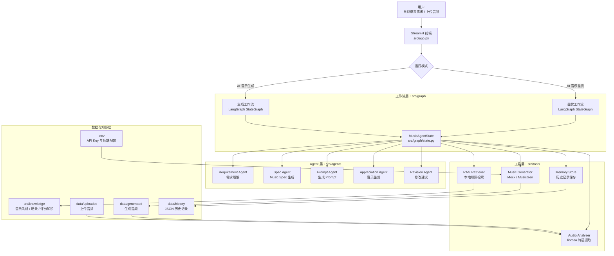
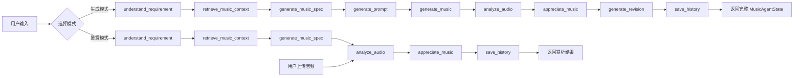
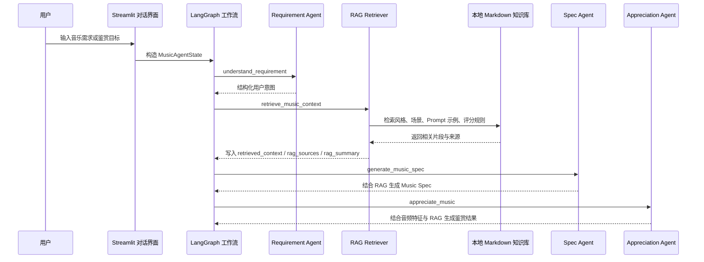
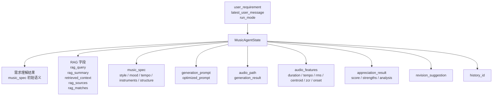

# MusicAgent Studio 架构图

本文档记录 MusicAgent Studio 当前版本的核心架构图，便于课程报告、README 或 GitHub 页面引用。图中内容以当前 `src` 目录实现为准。

## 1. 系统总体架构

## 2. 双模式工作流

## 3. RAG 增强链路

## 4. MusicAgentState 数据流

## 5. 运行与扩展说明

- 默认生成后端为本地 Mock，便于课堂 Demo 稳定运行。
- 可选 MusicGen 后端通过 `.env` 配置开启，生成失败时可回退到 Mock。
- 生成模式与鉴赏模式共享 RAG、音频分析、音乐鉴赏和历史保存模块。
- 后续可扩展向量数据库、云端音乐生成 API、长期记忆和更细粒度的 LLM 评价指标。
